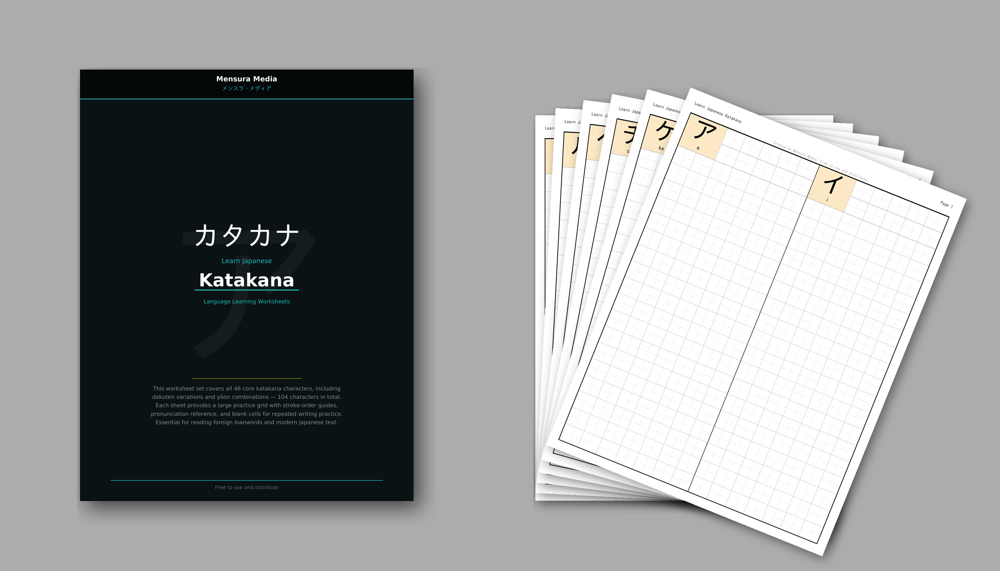
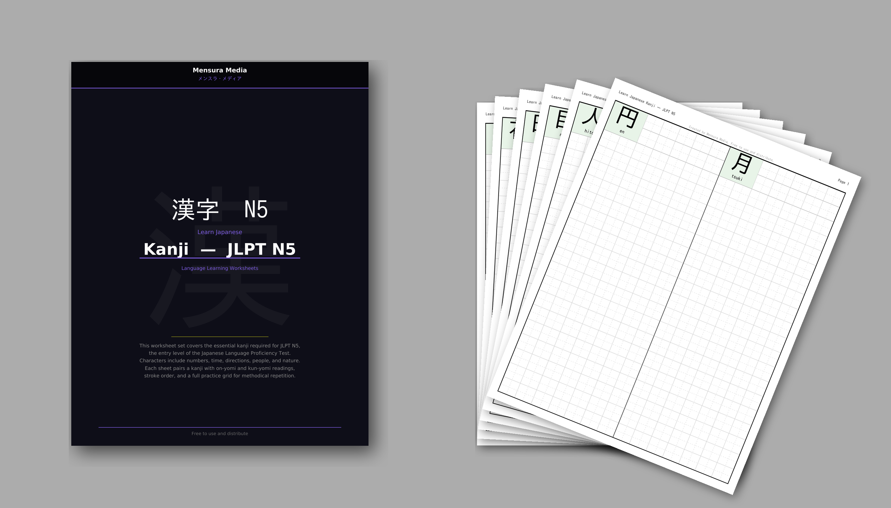
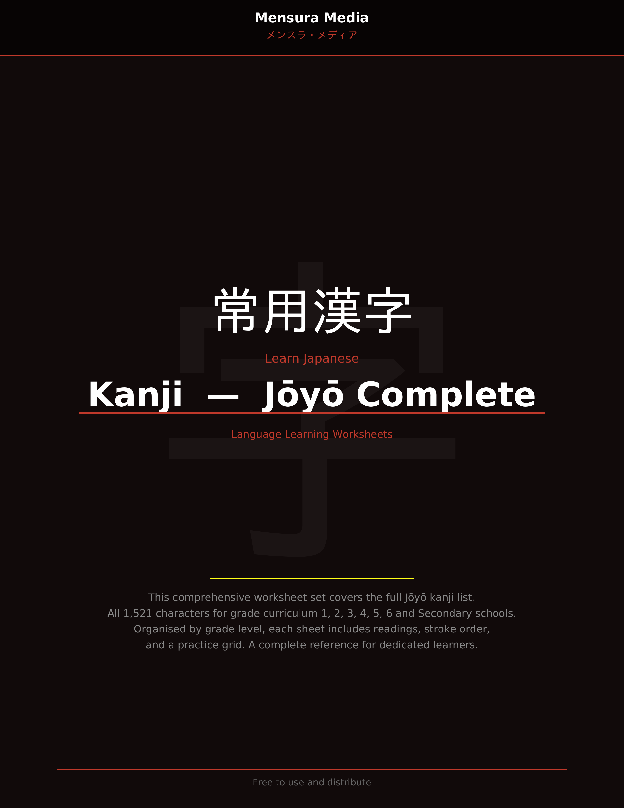

# Learn Japanese &mdash; Language Learning Worksheets

**Created by [Mensura Media](https://github.com/MensuraMedia)** &nbsp; | &nbsp; Free to use and distribute

A collection of free Japanese language learning worksheets and writing practice workbooks covering Hiragana, Katakana, Kanji, and essential vocabulary topics. Each worksheet set includes large character references, romaji pronunciation guides, and grid-based practice sheets for repeated handwriting practice.

---

## Hiragana &mdash; ひらがな

The foundational Japanese phonetic script. This set covers all 46 core hiragana characters plus dakuten variations and yoon combinations &mdash; **104 characters in total**. Each sheet provides a large character reference with romaji and practice grid cells for repeated writing.

| Cover | Example Pages |
|:---:|:---:|
|  |  |

**Contents:**
- **Writing Practice Workbook** &mdash; [`01-write-hiragana.pdf`](hiragana/01-write-hiragana.pdf) &mdash; Simple grid practice (2 characters per page, blue headers)
- **Full Worksheet Set** &mdash; [`japanese-worksheet-hiragana-mensura-media-pdfa.pdf`](hiragana/japanese-worksheet-hiragana-mensura-media-pdfa.pdf) &mdash; Cover page, table of contents, and 52 pages of writing practice

> Ideal for beginners starting their Japanese writing journey.

---

## Katakana &mdash; カタカナ

The phonetic script used for foreign loanwords and modern Japanese text. Same structure as hiragana &mdash; **104 characters** covering basic, dakuten, and yoon combinations.

| Cover | Example Pages |
|:---:|:---:|
|  |  |

**Contents:**
- **Writing Practice Workbook** &mdash; [`02-write-katakana.pdf`](katakana/02-write-katakana.pdf) &mdash; Simple grid practice (2 characters per page, tan headers)
- **Full Worksheet Set** &mdash; [`japanese-worksheet-katakana-mensura-media-pdfa.pdf`](katakana/japanese-worksheet-katakana-mensura-media-pdfa.pdf) &mdash; Cover page, table of contents, and 52 pages of writing practice

> Essential for reading foreign loanwords and modern Japanese text.

---

## Kanji &mdash; 漢字

Chinese-origin characters used in Japanese writing. Two worksheet sets are available covering beginner through advanced levels.

### JLPT N5 Kanji

The essential kanji required for the entry level of the Japanese Language Proficiency Test. Characters include numbers, time, directions, people, and nature. Each sheet pairs a kanji with readings and a full practice grid.

| Cover | Example Pages |
|:---:|:---:|
|  |  |

**Contents:**
- **Writing Practice Workbook** &mdash; [`03-write-kanji.pdf`](kanji/03-write-kanji.pdf) &mdash; Simple grid practice (2 kanji per page, green headers)
- **JLPT N5 Worksheet Set** &mdash; [`japanese-worksheet-kanji-n5-mensura-media-pdfa.pdf`](kanji/japanese-worksheet-kanji-n5-mensura-media-pdfa.pdf) &mdash; Cover page, table of contents, and 31 pages covering all N5 kanji

### Joyo Kanji &mdash; Complete

The full Joyo kanji list &mdash; all **1,521 characters** across Grade 1 through Grade 6 and Secondary school levels. Organised by grade level, each sheet includes large character reference, readings, and a practice grid. A complete reference for dedicated learners.

| Cover | Example Pages |
|:---:|:---:|
|  |  |

**Contents:**
- **Joyo Complete Worksheet Set** &mdash; [`japanese-worksheet-kanji-joyo-mensura-media-pdfa.pdf`](kanji/japanese-worksheet-kanji-joyo-mensura-media-pdfa.pdf) &mdash; Cover page, multi-page table of contents, and 548+ pages of practice

---

## Vocabulary Worksheets

Topic-based worksheets that combine a **reference & examples page** with kanji writing practice. Each set includes a cover page, a detailed reference sheet with vocabulary patterns, example sentences, and practice grid pages.

### Days of the Week &mdash; 曜日

| |
|:---:|
|  |

All 7 days with element breakdowns, relative day expressions, school schedule vocabulary, and time-of-week combinations.

- [`japanese-worksheet-days-mensura-media-pdfa.pdf`](vocabulary/japanese-worksheet-days-mensura-media-pdfa.pdf)

### Months &mdash; 月

| |
|:---:|
|  |

All 12 months with seasons, school calendar terms, festivals & events, date expressions, and counter words.

- [`japanese-worksheet-months-mensura-media-pdfa.pdf`](vocabulary/japanese-worksheet-months-mensura-media-pdfa.pdf)

### Numbers &mdash; 数字

| |
|:---:|
|  |

Kanji numbers from 0 to 1,000,000,000,000 with teens, tens, hundreds, thousands, ten-thousands, and 100-millions. Includes number pattern breakdowns.

- [`japanese-worksheet-numbers-mensura-media-pdfa.pdf`](vocabulary/japanese-worksheet-numbers-mensura-media-pdfa.pdf)

### Time &mdash; 時間

| |
|:---:|
|  |

Clock reading with hours, minutes, seconds, AM/PM, durations, time-of-day expressions, greetings by time, and common time vocabulary.

- [`japanese-worksheet-time-mensura-media-pdfa.pdf`](vocabulary/japanese-worksheet-time-mensura-media-pdfa.pdf)

---

## Repository Structure

```
language-learning/
├── README.md
├── images/                     # Cover and example images
├── hiragana/                   # Hiragana writing practice
│   ├── 01-write-hiragana.pdf
│   └── japanese-worksheet-hiragana-mensura-media-pdfa.pdf
├── katakana/                   # Katakana writing practice
│   ├── 02-write-katakana.pdf
│   └── japanese-worksheet-katakana-mensura-media-pdfa.pdf
├── kanji/                      # Kanji writing practice
│   ├── 03-write-kanji.pdf
│   ├── japanese-worksheet-kanji-n5-mensura-media-pdfa.pdf
│   └── japanese-worksheet-kanji-joyo-mensura-media-pdfa.pdf
└── vocabulary/                 # Topic-based vocabulary worksheets
    ├── japanese-worksheet-days-mensura-media-pdfa.pdf
    ├── japanese-worksheet-months-mensura-media-pdfa.pdf
    ├── japanese-worksheet-numbers-mensura-media-pdfa.pdf
    └── japanese-worksheet-time-mensura-media-pdfa.pdf
```

## License

Free to use and distribute. Created by **Mensura Media** (メンスラ・メディア).
