# Learn Japanese &mdash; Language Learning Worksheets

**Created by [Mensura Media](https://github.com/MensuraMedia)** &nbsp; | &nbsp; Free to use and distribute

A collection of free Japanese language learning worksheets and writing practice workbooks covering Hiragana, Katakana, Kanji, and essential vocabulary topics. Each worksheet set includes large character references, romaji pronunciation guides, and grid-based practice sheets for repeated handwriting practice.

### Worksheets

1. [Hiragana Writing Practice](hiragana/01-write-hiragana.pdf)
2. [Hiragana Worksheet Set](hiragana/japanese-worksheet-hiragana-mensura-media-pdfa.pdf)
3. [Katakana Writing Practice](katakana/02-write-katakana.pdf)
4. [Katakana Worksheet Set](katakana/japanese-worksheet-katakana-mensura-media-pdfa.pdf)
5. [Kanji N5 Writing Practice](kanji/03-write-kanji.pdf)
6. [Kanji &mdash; JLPT N5 Worksheet Set](kanji/japanese-worksheet-kanji-n5-mensura-media-pdfa.pdf)
7. [Kanji &mdash; Joyo Complete Worksheet Set](kanji/japanese-worksheet-kanji-joyo-mensura-media-pdfa.pdf)
8. [Days of the Week](vocabulary/japanese-worksheet-days-mensura-media-pdfa.pdf)
9. [Months](vocabulary/japanese-worksheet-months-mensura-media-pdfa.pdf)
10. [Numbers](vocabulary/japanese-worksheet-numbers-mensura-media-pdfa.pdf)
11. [Time](vocabulary/japanese-worksheet-time-mensura-media-pdfa.pdf)
12. [Blank Worksheet](vocabulary/blank_worksheet.pdf)

### Reference Charts

13. [Hiragana Reference Chart](hiragana/reference_chart_hiragana.pdf)
14. [Katakana Reference Chart](katakana/reference_chart_katakana.pdf)
15. [Kanji N5 Reference Chart](kanji/reference_chart_kanji_n5.pdf)
16. [Kanji N4 Reference Chart](kanji/reference_chart_kanji_n4.pdf)
17. [Kanji N3 Reference Chart](kanji/reference_chart_kanji_n3.pdf)
18. [Kanji N2 Reference Chart](kanji/reference_chart_kanji_n2.pdf)
19. [Kanji N1 Reference Chart](kanji/reference_chart_kanji_n1.pdf)

### Flash Cards

20. [Hiragana Flash Cards](hiragana/flashcard_hiragana.pdf)
21. [Katakana Flash Cards](katakana/flashcard_katakana.pdf)

### Wall Prints

22. [Hiragana Wall Prints](hiragana/wall_prints_hiragana.pdf)
23. [Katakana Wall Prints](katakana/wall_prints_katakana.pdf)
24. [Top 200 Kanji Wall Chart](kanji/wall_prints_kanji_wall_200.pdf)

---

## Hiragana &mdash; ひらがな

The foundational Japanese phonetic script. This set covers all 46 core hiragana characters plus dakuten variations and yoon combinations &mdash; **104 characters in total**. Each sheet provides a large character reference with romaji and practice grid cells for repeated writing.

| Worksheet | Reference Chart | Flash Cards | Wall Prints |
|:---:|:---:|:---:|:---:|
|  | 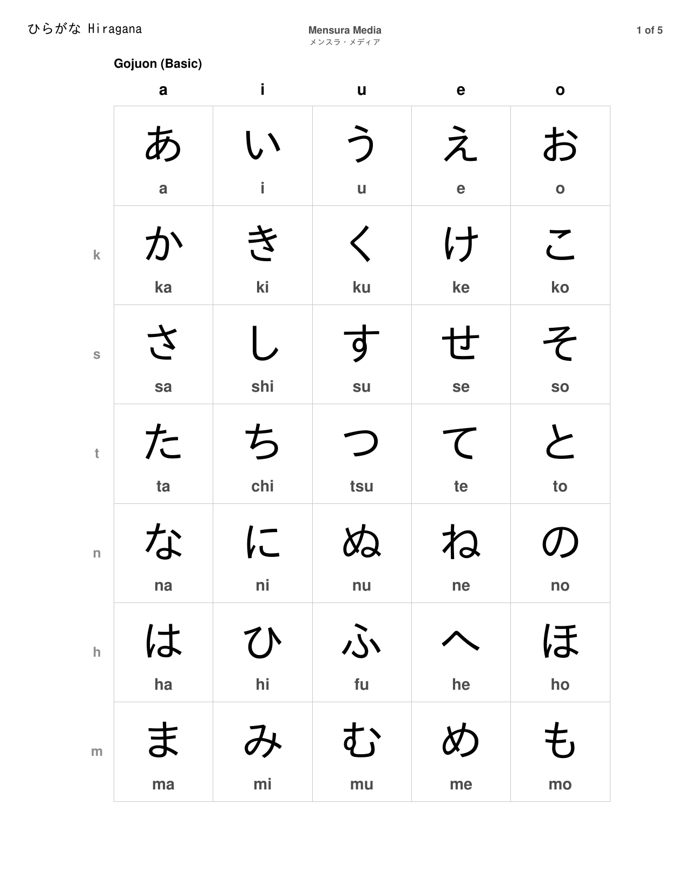 | 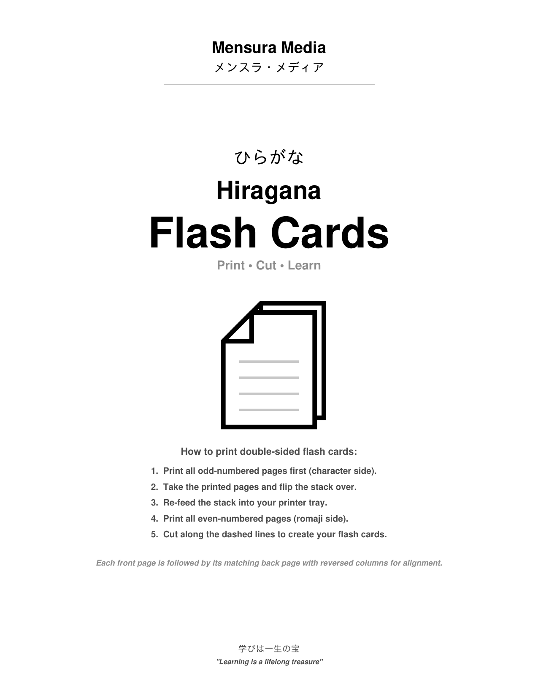 | 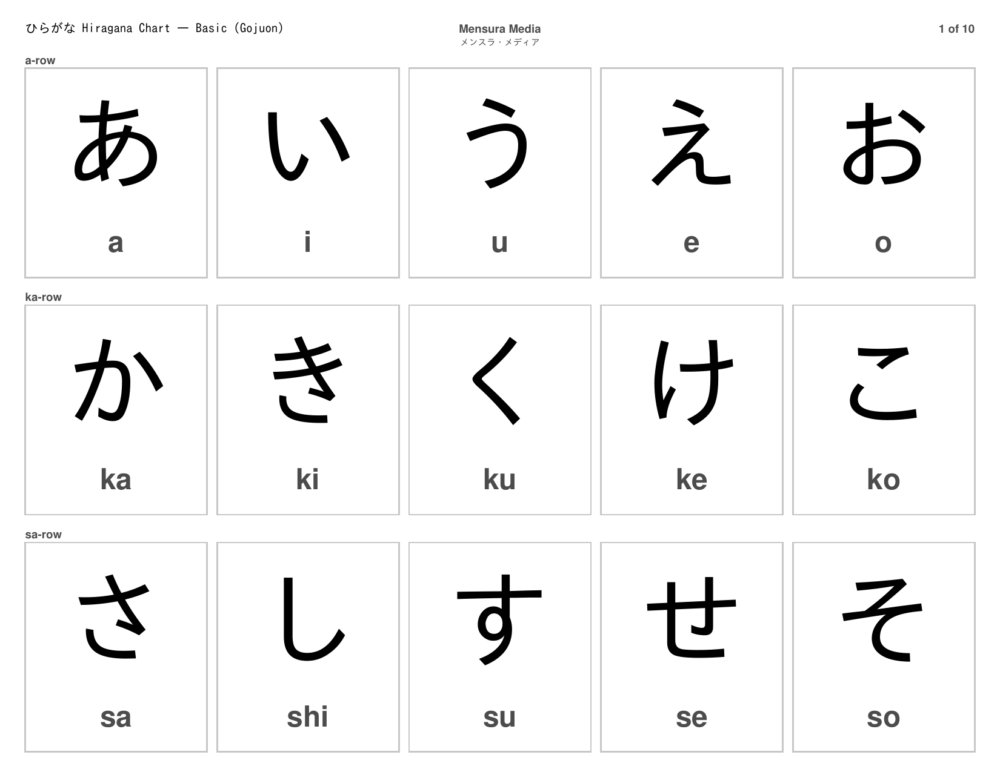 |

**Contents:**
- **Writing Practice Workbook** &mdash; [`01-write-hiragana.pdf`](hiragana/01-write-hiragana.pdf) &mdash; Simple grid practice (2 characters per page, blue headers)
- **Full Worksheet Set** &mdash; [`japanese-worksheet-hiragana-mensura-media-pdfa.pdf`](hiragana/japanese-worksheet-hiragana-mensura-media-pdfa.pdf) &mdash; Cover page, table of contents, and 52 pages of writing practice
- **Reference Chart** &mdash; [`reference_chart_hiragana.pdf`](hiragana/reference_chart_hiragana.pdf) &mdash; 2-page quick-reference with all gojuon, dakuon, han-dakuon, and yoon characters, common words by row, sample sentences, and a particles cheat sheet
- **Flash Cards** &mdash; [`flashcard_hiragana.pdf`](hiragana/flashcard_hiragana.pdf) &mdash; 23-page printable double-sided flash cards (character on front, romaji with pronunciation guide on back). Print, cut, and learn
- **Wall Prints** &mdash; [`wall_prints_hiragana.pdf`](hiragana/wall_prints_hiragana.pdf) &mdash; 10-page large-format wall chart with all characters displayed in bold, organized by row (gojuon, dakuon, yoon)

> Ideal for beginners starting their Japanese writing journey.

---

## Katakana &mdash; カタカナ

The phonetic script used for foreign loanwords and modern Japanese text. Same structure as hiragana &mdash; **104 characters** covering basic, dakuten, and yoon combinations.

| Worksheet | Reference Chart | Flash Cards | Wall Prints |
|:---:|:---:|:---:|:---:|
|  | 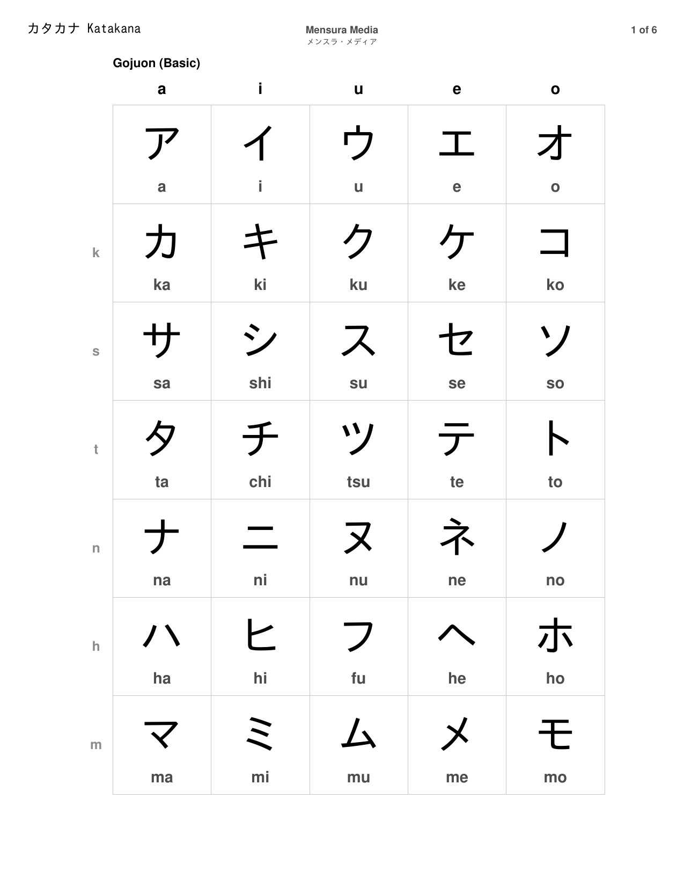 |  | 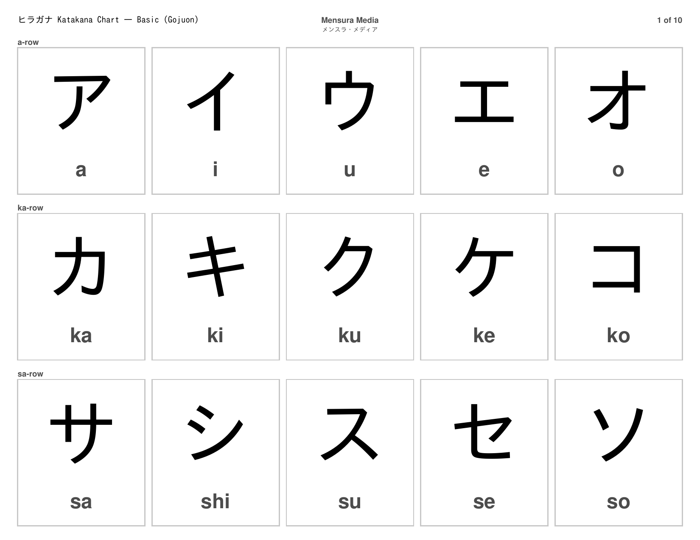 |

**Contents:**
- **Writing Practice Workbook** &mdash; [`02-write-katakana.pdf`](katakana/02-write-katakana.pdf) &mdash; Simple grid practice (2 characters per page, tan headers)
- **Full Worksheet Set** &mdash; [`japanese-worksheet-katakana-mensura-media-pdfa.pdf`](katakana/japanese-worksheet-katakana-mensura-media-pdfa.pdf) &mdash; Cover page, table of contents, and 52 pages of writing practice
- **Reference Chart** &mdash; [`reference_chart_katakana.pdf`](katakana/reference_chart_katakana.pdf) &mdash; 2-page quick-reference with all gojuon, dakuon, han-dakuon, and yoon characters, common loanwords by row, sample sentences, and a particles cheat sheet
- **Flash Cards** &mdash; [`flashcard_katakana.pdf`](katakana/flashcard_katakana.pdf) &mdash; 23-page printable double-sided flash cards (character on front, romaji with pronunciation guide on back). Print, cut, and learn
- **Wall Prints** &mdash; [`wall_prints_katakana.pdf`](katakana/wall_prints_katakana.pdf) &mdash; 10-page large-format wall chart with all characters displayed in bold, organized by row (gojuon, dakuon, yoon)

> Essential for reading foreign loanwords and modern Japanese text.

---

## Kanji &mdash; 漢字

Chinese-origin characters used in Japanese writing. Worksheet sets, reference charts, and wall prints are available covering all JLPT levels from beginner (N5) through advanced (N1), plus the complete Joyo set.

### JLPT N5 Kanji

The essential kanji required for the entry level of the Japanese Language Proficiency Test. Characters include numbers, time, directions, people, and nature. Each sheet pairs a kanji with readings and a full practice grid.

| Worksheet | Reference Chart |
|:---:|:---:|
| 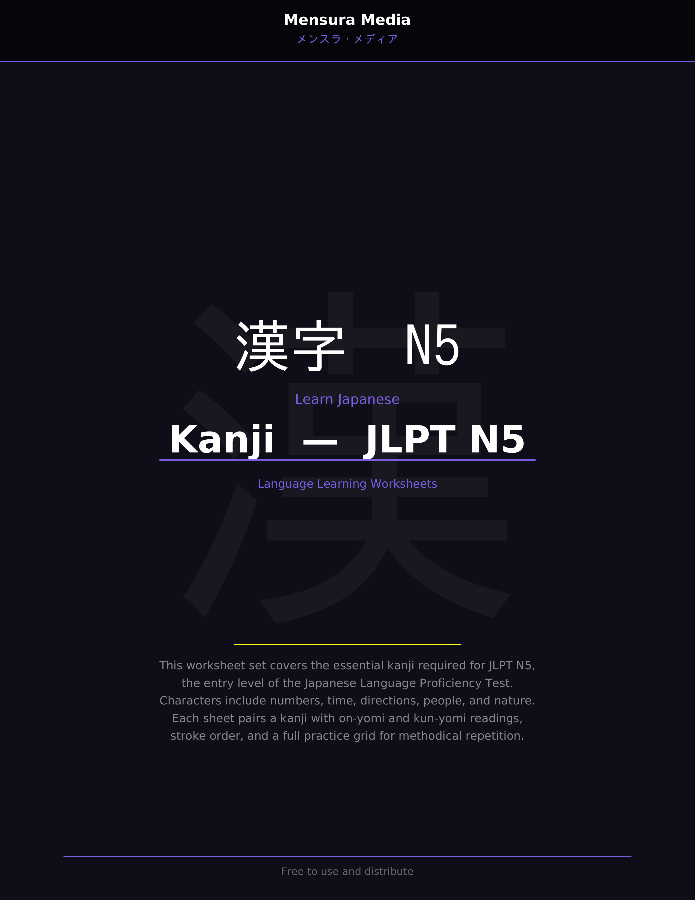 | 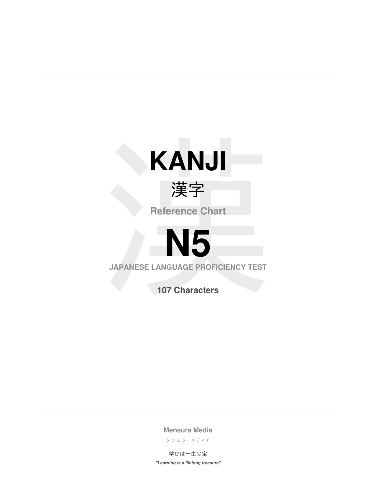 |

**Contents:**
- **Writing Practice Workbook** &mdash; [`03-write-kanji.pdf`](kanji/03-write-kanji.pdf) &mdash; Simple grid practice (2 kanji per page, green headers)
- **JLPT N5 Worksheet Set** &mdash; [`japanese-worksheet-kanji-n5-mensura-media-pdfa.pdf`](kanji/japanese-worksheet-kanji-n5-mensura-media-pdfa.pdf) &mdash; Cover page, table of contents, and 31 pages covering all N5 kanji
- **N5 Reference Chart** &mdash; [`reference_chart_kanji_n5.pdf`](kanji/reference_chart_kanji_n5.pdf) &mdash; 107 characters &mdash; cover page with alphabetical index listing each kanji, English meaning, and reading

### JLPT N4 Kanji

The next level of JLPT kanji, building on N5 with characters for everyday actions, descriptions, and concepts.

<p align="center"></p>

**Contents:**
- **N4 Reference Chart** &mdash; [`reference_chart_kanji_n4.pdf`](kanji/reference_chart_kanji_n4.pdf) &mdash; 174 characters &mdash; cover page with alphabetical index listing each kanji, English meaning, and reading

### JLPT N3 Kanji

Intermediate-level kanji covering a broad range of topics including abstract concepts, emotions, and formal vocabulary.

<p align="center"></p>

**Contents:**
- **N3 Reference Chart** &mdash; [`reference_chart_kanji_n3.pdf`](kanji/reference_chart_kanji_n3.pdf) &mdash; 394 characters &mdash; cover page with alphabetical index listing each kanji, English meaning, and reading

### JLPT N2 Kanji

Upper-intermediate kanji used in news, literature, and professional contexts.

<p align="center">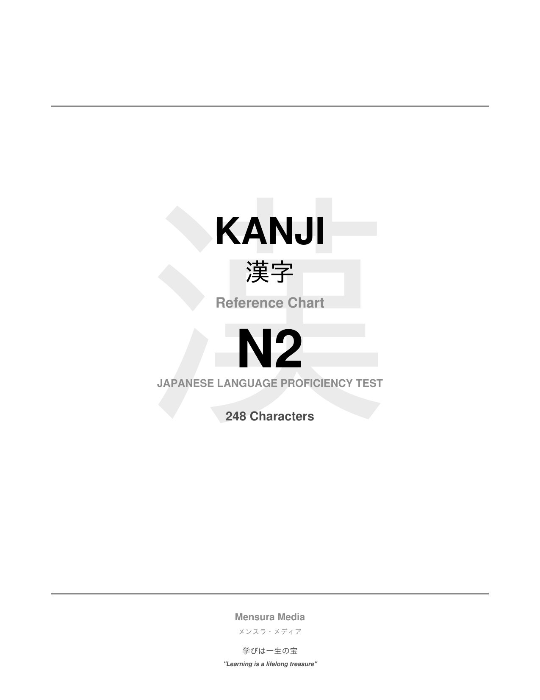</p>

**Contents:**
- **N2 Reference Chart** &mdash; [`reference_chart_kanji_n2.pdf`](kanji/reference_chart_kanji_n2.pdf) &mdash; 248 characters &mdash; cover page with alphabetical index listing each kanji, English meaning, and reading

### JLPT N1 Kanji

The most advanced JLPT level, covering rare and specialized kanji found in academic, literary, and formal writing.

<p align="center">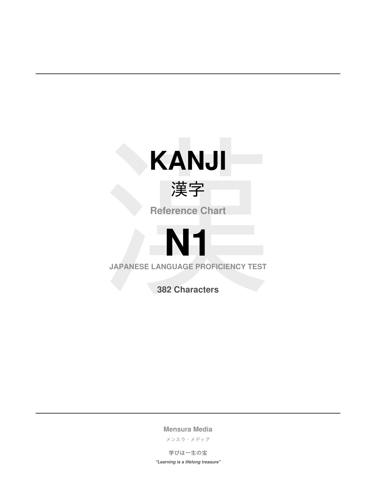</p>

**Contents:**
- **N1 Reference Chart** &mdash; [`reference_chart_kanji_n1.pdf`](kanji/reference_chart_kanji_n1.pdf) &mdash; 382 characters &mdash; cover page with alphabetical index listing each kanji, English meaning, and reading

### Joyo Kanji &mdash; Complete

The full Joyo kanji list &mdash; all **1,521 characters** across Grade 1 through Grade 6 and Secondary school levels. Organised by grade level, each sheet includes large character reference, readings, and a practice grid. A complete reference for dedicated learners.

| Example Pages |
|:---:|
| 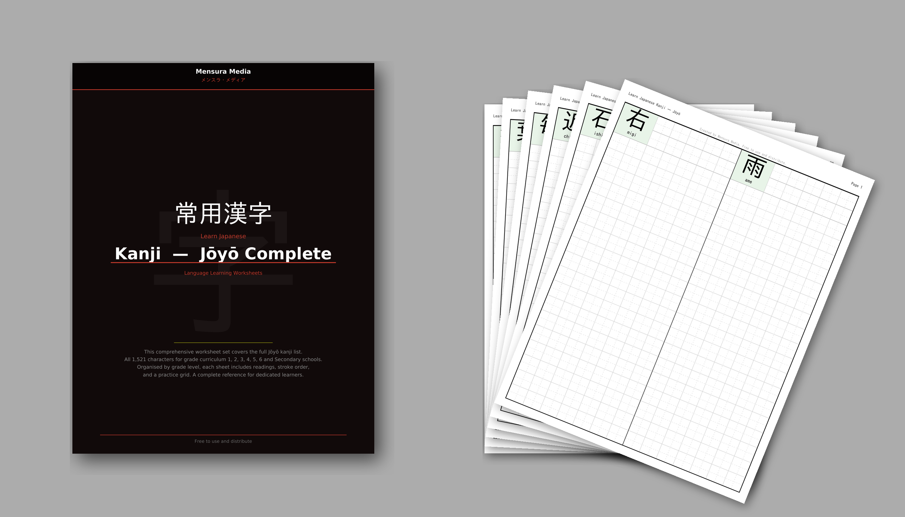 |

**Contents:**
- **Joyo Complete Worksheet Set** &mdash; [`japanese-worksheet-kanji-joyo-mensura-media-pdfa.pdf`](kanji/japanese-worksheet-kanji-joyo-mensura-media-pdfa.pdf) &mdash; Cover page, multi-page table of contents, and 548+ pages of practice

### Top 200 Kanji Wall Chart

A 14-page large-format wall chart featuring the 200 most essential kanji, organized by category: Numbers & Counting, People & Family, Nature & Weather, Time & Calendar, Actions, Descriptions, Places, and more. Each card shows the kanji in bold with romaji reading and English meaning.

<p align="center">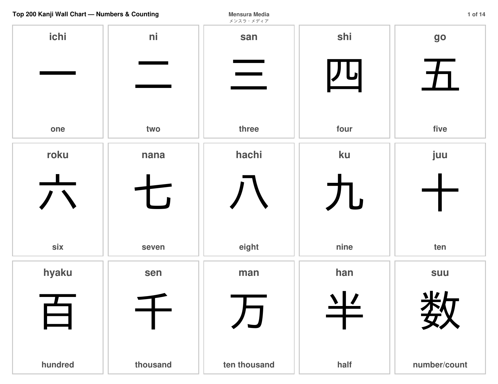</p>

**Contents:**
- **Wall Chart** &mdash; [`wall_prints_kanji_wall_200.pdf`](kanji/wall_prints_kanji_wall_200.pdf) &mdash; 14 pages of large, printable kanji cards grouped by topic

---

## Vocabulary Worksheets

Topic-based worksheets that combine a **reference & examples page** with kanji writing practice. Each set includes a cover page, a detailed reference sheet with vocabulary patterns, example sentences, and practice grid pages.

### Days of the Week &mdash; 曜日

<p align="center">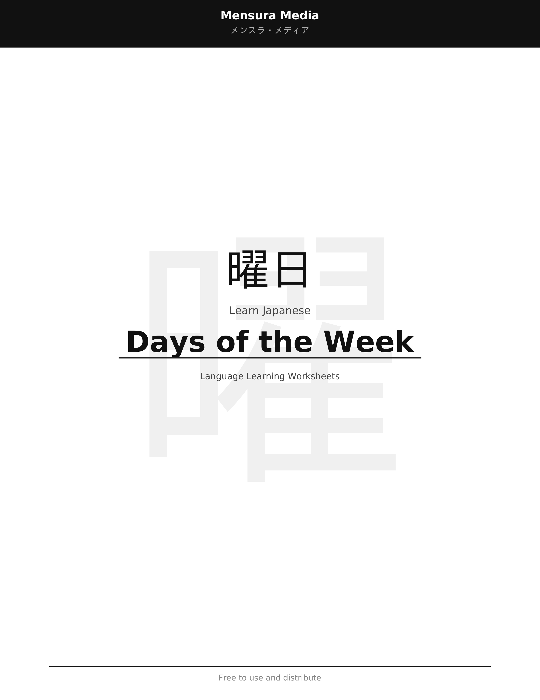</p>

All 7 days with element breakdowns, relative day expressions, school schedule vocabulary, and time-of-week combinations.

- [`japanese-worksheet-days-mensura-media-pdfa.pdf`](vocabulary/japanese-worksheet-days-mensura-media-pdfa.pdf)

### Months &mdash; 月

<p align="center">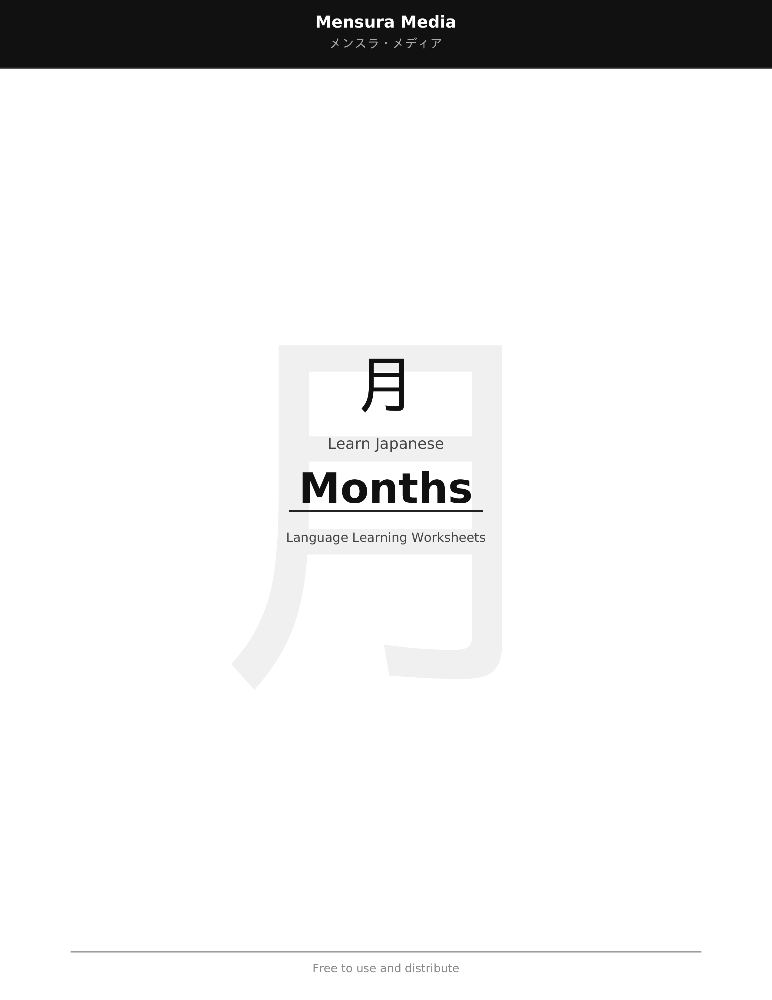</p>

All 12 months with seasons, school calendar terms, festivals & events, date expressions, and counter words.

- [`japanese-worksheet-months-mensura-media-pdfa.pdf`](vocabulary/japanese-worksheet-months-mensura-media-pdfa.pdf)

### Numbers &mdash; 数字

<p align="center">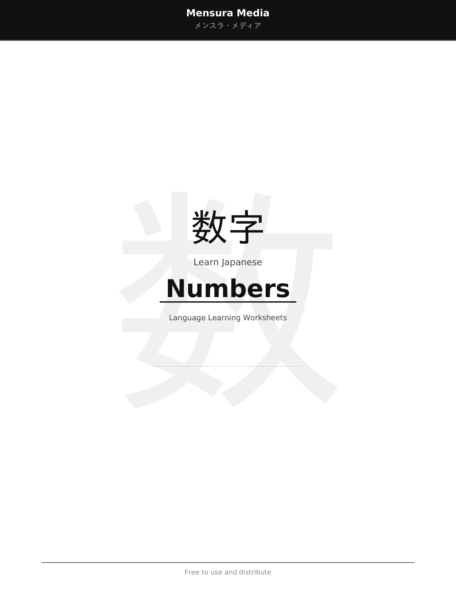</p>

Kanji numbers from 0 to 1,000,000,000,000 with teens, tens, hundreds, thousands, ten-thousands, and 100-millions. Includes number pattern breakdowns.

- [`japanese-worksheet-numbers-mensura-media-pdfa.pdf`](vocabulary/japanese-worksheet-numbers-mensura-media-pdfa.pdf)

### Time &mdash; 時間

<p align="center">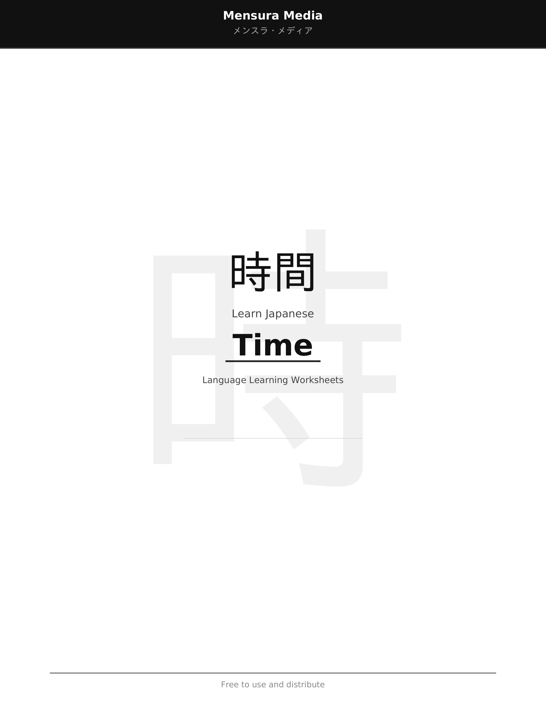</p>

Clock reading with hours, minutes, seconds, AM/PM, durations, time-of-day expressions, greetings by time, and common time vocabulary.

- [`japanese-worksheet-time-mensura-media-pdfa.pdf`](vocabulary/japanese-worksheet-time-mensura-media-pdfa.pdf)

---

## Repository Structure

```
language-learning/
├── README.md
├── images/                     # Cover and example images
├── hiragana/                   # Hiragana writing practice & study tools
│   ├── 01-write-hiragana.pdf
│   ├── japanese-worksheet-hiragana-mensura-media-pdfa.pdf
│   ├── reference_chart_hiragana.pdf
│   ├── flashcard_hiragana.pdf
│   └── wall_prints_hiragana.pdf
├── katakana/                   # Katakana writing practice & study tools
│   ├── 02-write-katakana.pdf
│   ├── japanese-worksheet-katakana-mensura-media-pdfa.pdf
│   ├── reference_chart_katakana.pdf
│   ├── flashcard_katakana.pdf
│   └── wall_prints_katakana.pdf
├── kanji/                      # Kanji writing practice & reference charts
│   ├── 03-write-kanji.pdf
│   ├── japanese-worksheet-kanji-n5-mensura-media-pdfa.pdf
│   ├── japanese-worksheet-kanji-joyo-mensura-media-pdfa.pdf
│   ├── reference_chart_kanji_n5.pdf
│   ├── reference_chart_kanji_n4.pdf
│   ├── reference_chart_kanji_n3.pdf
│   ├── reference_chart_kanji_n2.pdf
│   ├── reference_chart_kanji_n1.pdf
│   └── wall_prints_kanji_wall_200.pdf
└── vocabulary/                 # Topic-based vocabulary worksheets
    ├── japanese-worksheet-days-mensura-media-pdfa.pdf
    ├── japanese-worksheet-months-mensura-media-pdfa.pdf
    ├── japanese-worksheet-numbers-mensura-media-pdfa.pdf
    ├── japanese-worksheet-time-mensura-media-pdfa.pdf
    └── blank_worksheet.pdf
```

## License

Free to use and distribute. Created by **Mensura Media** (メンスラ・メディア).
