# 英語を学ぼう &mdash; 語学学習ワークシート

**制作：[Mensura Media](https://github.com/MensuraMedia)** &nbsp; | &nbsp; 無料で使用・配布できます

日本語話者のための英語学習教材コレクションです。アルファベット、フォニックス、サイトワード、基本語彙、文法、英検対策など幅広い教材を揃えています。すべての教材にカタカナ読みと日本語訳が付いています。

### ワークシート・レッスン

1. [レッスン入門](en_lessons/lesson_primer.pdf)

### リファレンスチャート

2. [アルファベット](en_alphabet/reference_chart_alphabet.pdf)
3. [フォニックス](en_phonics/reference_chart_phonics.pdf)
4. [サイトワード](en_sightwords/reference_chart_sightwords.pdf)
5. [形容詞](en_vocabulary/reference_chart_adjectives.pdf)
6. [英検5級 単語](en_vocabulary/reference_chart_eiken5.pdf)
7. [時間・暦](en_grammar/reference_chart_time.pdf)
8. [数字](en_grammar/reference_chart_numbers.pdf)
9. [基本表現](en_grammar/reference_chart_expressions.pdf)
10. [文法基礎](en_grammar/reference_chart_grammar.pdf)

### フラッシュカード

11. [フォニックス](en_phonics/flashcard_phonics.pdf)
12. [サイトワード Top 200](en_sightwords/flashcard_sightwords_200.pdf)
13. [サイトワード 完全版](en_sightwords/flashcard_sightwords_all.pdf)
14. [英検5級 単語](en_vocabulary/flashcard_eiken5.pdf)

### 壁掛けポスター

15. [アルファベット](en_alphabet/wall_prints_alphabet.pdf)
16. [フォニックス](en_phonics/wall_prints_phonics.pdf)
17. [サイトワード Top 200](en_sightwords/wall_prints_sightwords.pdf)
18. [名詞](en_vocabulary/wall_prints_nouns.pdf)
19. [動詞](en_vocabulary/wall_prints_verbs.pdf)
20. [形容詞](en_vocabulary/wall_prints_adjectives.pdf)
21. [英検5級 単語](en_vocabulary/wall_prints_eiken5.pdf)

---

## アルファベット &mdash; Alphabet

英語の基本文字であるA〜Zの26文字。大文字・小文字、カタカナ読み、例単語、日本語訳付き。

| リファレンスチャート | 壁掛けポスター |
|:---:|:---:|
| 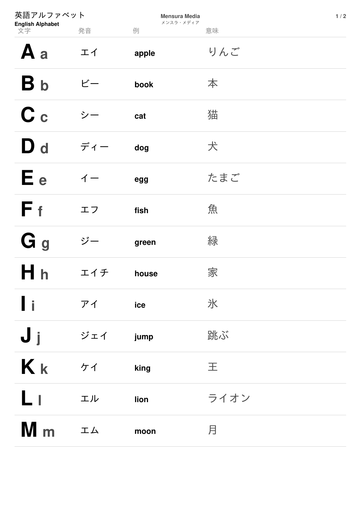 | 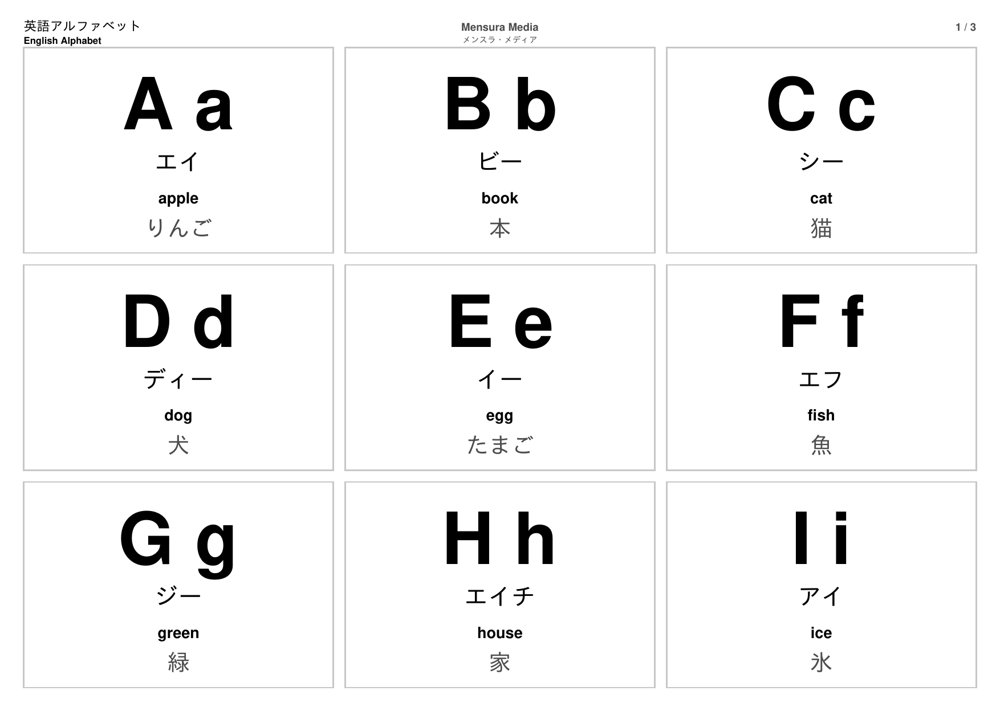 |

**内容：**
- **リファレンスチャート** &mdash; [`reference_chart_alphabet.pdf`](en_alphabet/reference_chart_alphabet.pdf) &mdash; A〜Zの全26文字、大文字・小文字、カタカナ発音、例単語と日本語訳（2ページ）
- **壁掛けポスター** &mdash; [`wall_prints_alphabet.pdf`](en_alphabet/wall_prints_alphabet.pdf) &mdash; 大判の壁掛け用、1ページ9文字の大きなカード（3ページ）

> アルファベットを初めて学ぶ方に最適です。

---

## フォニックス &mdash; Phonics

英語の発音ルール。短母音、長母音、子音二重字（sh, ch, th, wh, ph, ng）、子音連結（bl, br, cl, cr, dr, fl, fr, gl, gr, pl, pr, sl, sm, sn, sp, st）をカバー。

| リファレンスチャート | フラッシュカード | 壁掛けポスター |
|:---:|:---:|:---:|
| 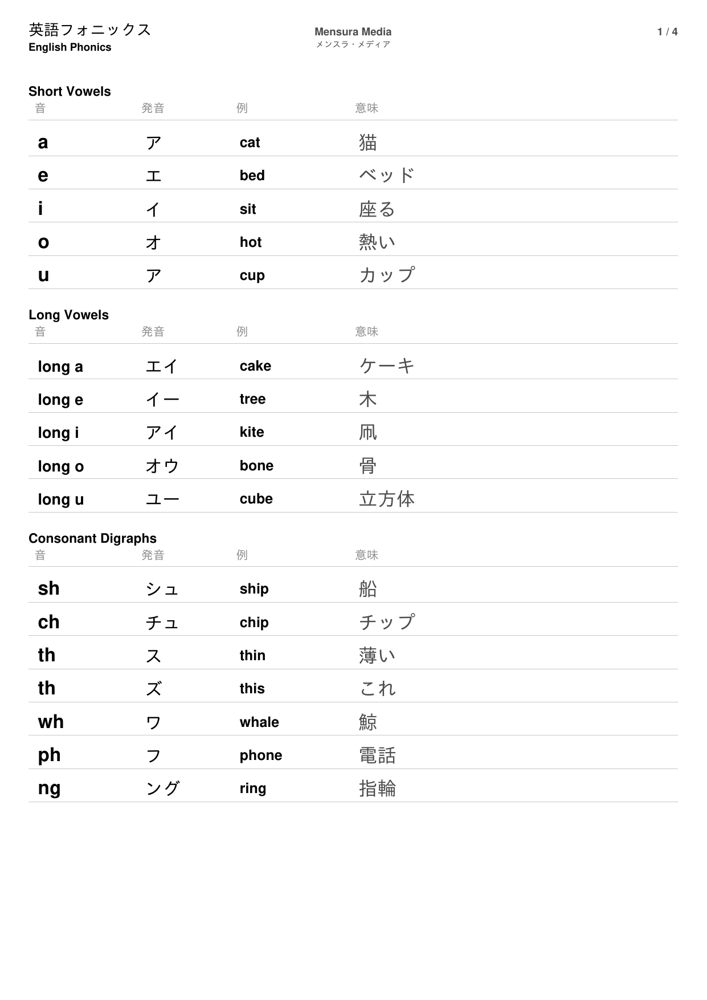 | 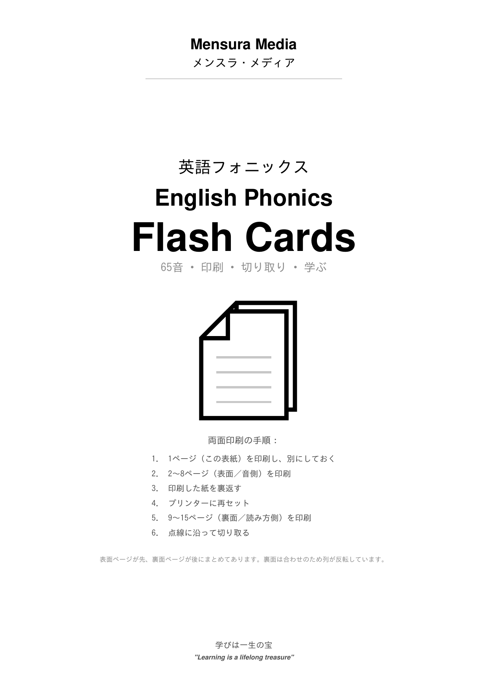 | 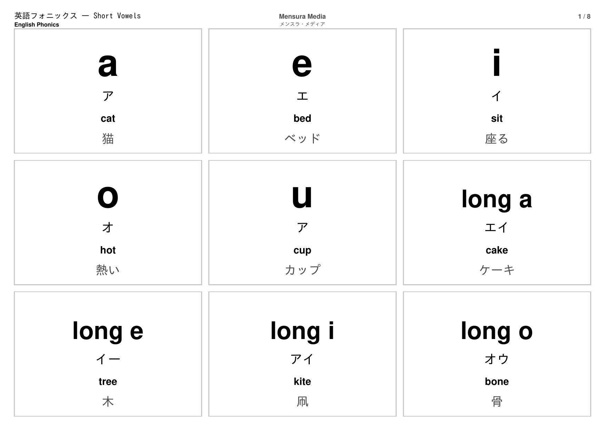 |

| サンプルページ |
|:---:|
| 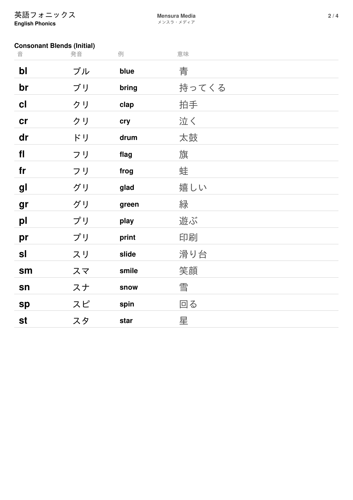 |

**内容：**
- **リファレンスチャート** &mdash; [`reference_chart_phonics.pdf`](en_phonics/reference_chart_phonics.pdf) &mdash; 全フォニックスルール、カタカナ読み、例単語と日本語訳（4ページ）
- **フラッシュカード** &mdash; [`flashcard_phonics.pdf`](en_phonics/flashcard_phonics.pdf) &mdash; 65音の両面印刷カード。表に音、裏にカタカナ・例単語・日本語訳（15ページ）
- **壁掛けポスター** &mdash; [`wall_prints_phonics.pdf`](en_phonics/wall_prints_phonics.pdf) &mdash; 大判の壁掛け用、セクション別に整理（8ページ）

> 正しい発音の基礎を身につけましょう。

---

## サイトワード &mdash; Sight Words

よく使われる基本単語（ドルチサイトワード）。学年別に整理され、カタカナ読みと日本語訳付き。

| リファレンスチャート | フラッシュカード Top 200 | フラッシュカード 完全版 | 壁掛けポスター |
|:---:|:---:|:---:|:---:|
| 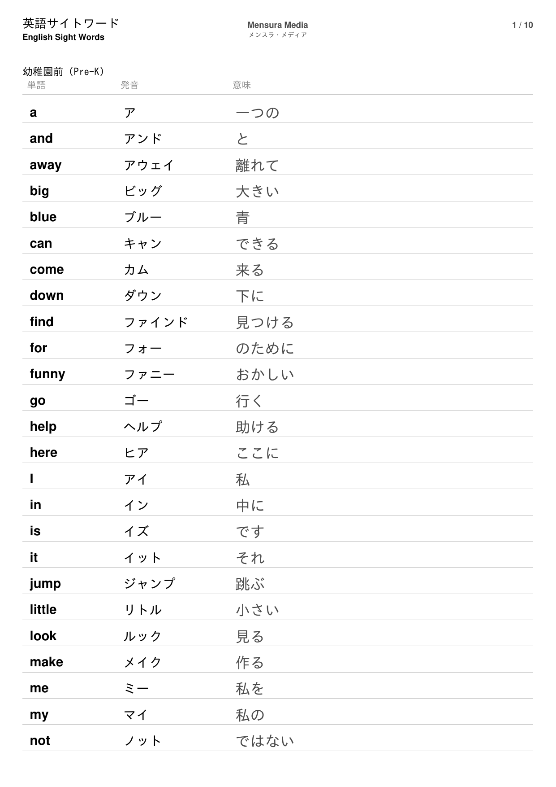 | 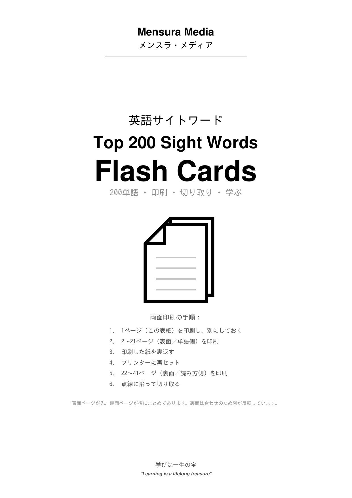 | 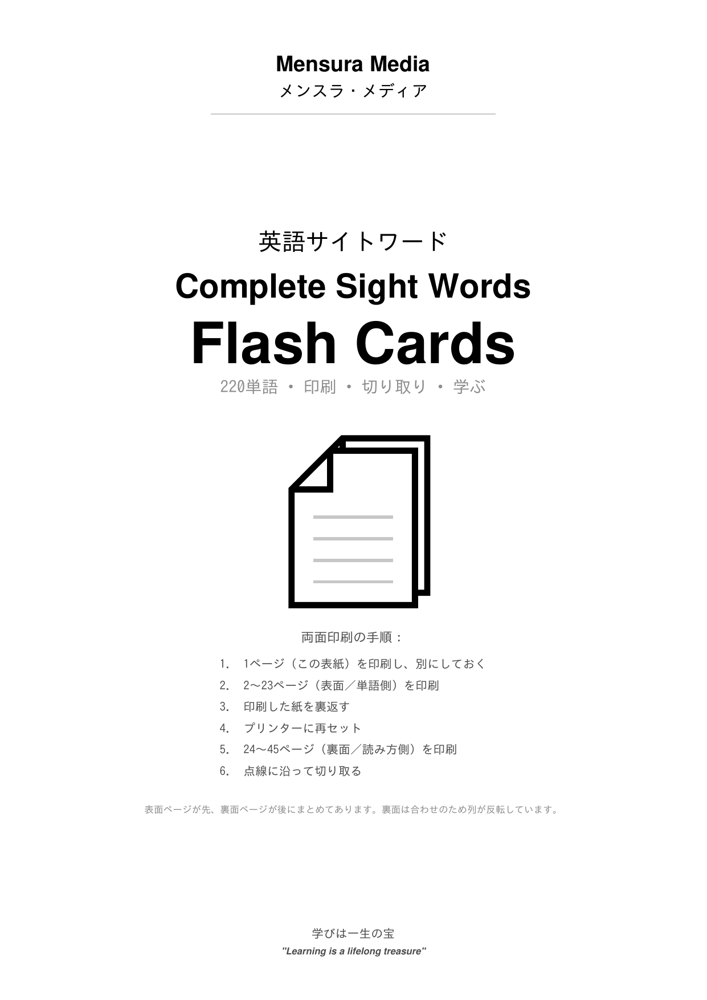 | 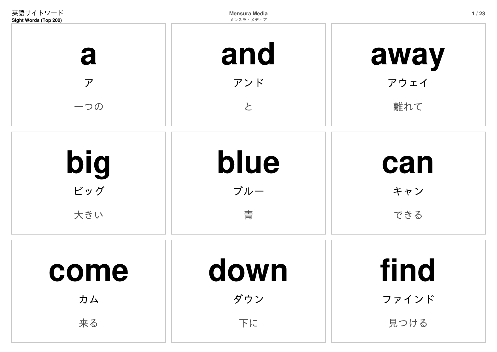 |

| サンプルページ |
|:---:|
| 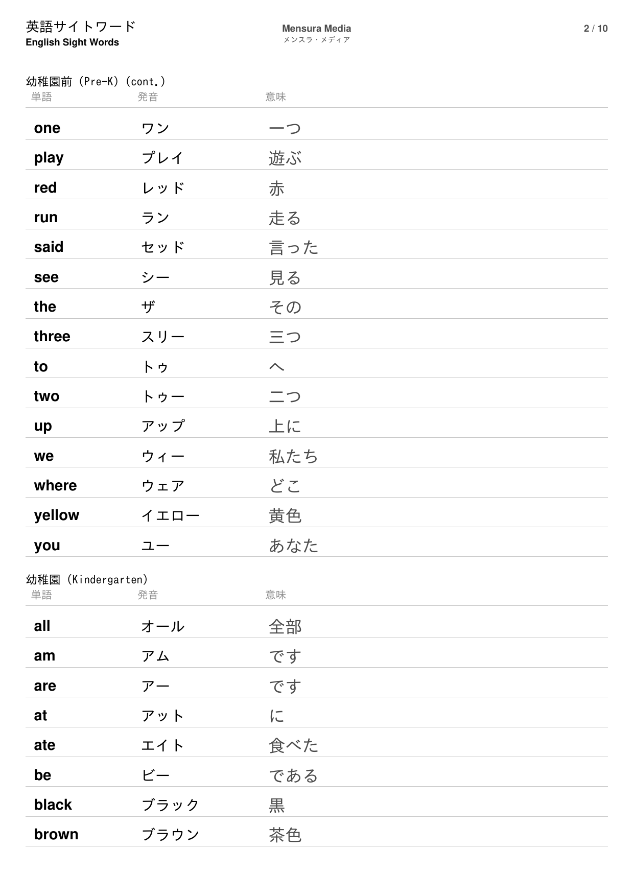 |

**内容：**
- **リファレンスチャート** &mdash; [`reference_chart_sightwords.pdf`](en_sightwords/reference_chart_sightwords.pdf) &mdash; ドルチサイトワード全単語、学年別整理（10ページ）
- **フラッシュカード Top 200** &mdash; [`flashcard_sightwords_200.pdf`](en_sightwords/flashcard_sightwords_200.pdf) &mdash; 頻出200単語の両面印刷カード（41ページ）
- **フラッシュカード 完全版** &mdash; [`flashcard_sightwords_all.pdf`](en_sightwords/flashcard_sightwords_all.pdf) &mdash; ドルチ全220単語の両面印刷カード（45ページ）
- **壁掛けポスター** &mdash; [`wall_prints_sightwords.pdf`](en_sightwords/wall_prints_sightwords.pdf) &mdash; Top 200サイトワードの大判壁掛けカード（23ページ）

> 読み書きの基礎となる必須単語です。

---

## 基本語彙 &mdash; Vocabulary

日常で使う名詞、動詞、形容詞の基本語彙。テーマ別に整理され、カタカナ読みと日本語訳付き。

### 形容詞 &mdash; Adjectives

反対語ペアとテーマ別グループで整理。サイズ、年齢、速度、温度、感情、状態、外見など。

| リファレンスチャート | 壁掛けポスター |
|:---:|:---:|
| 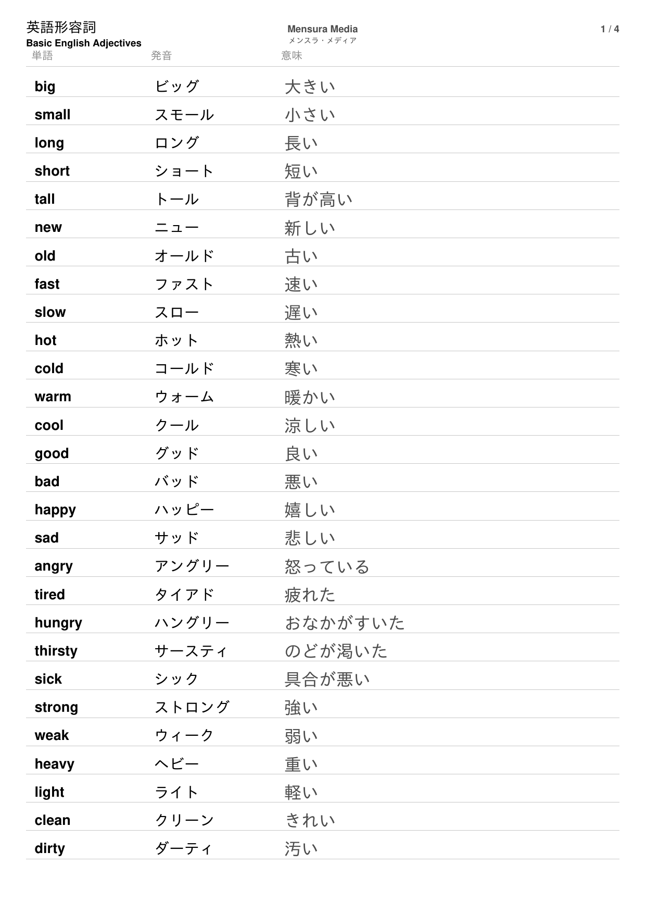 | 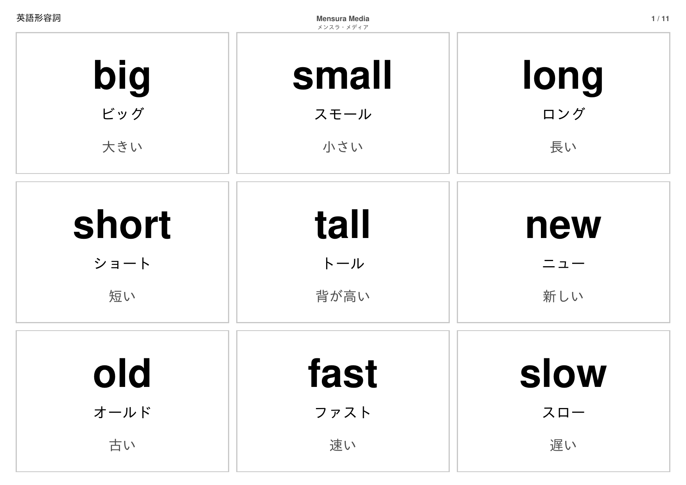 |

| サンプルページ |
|:---:|
| 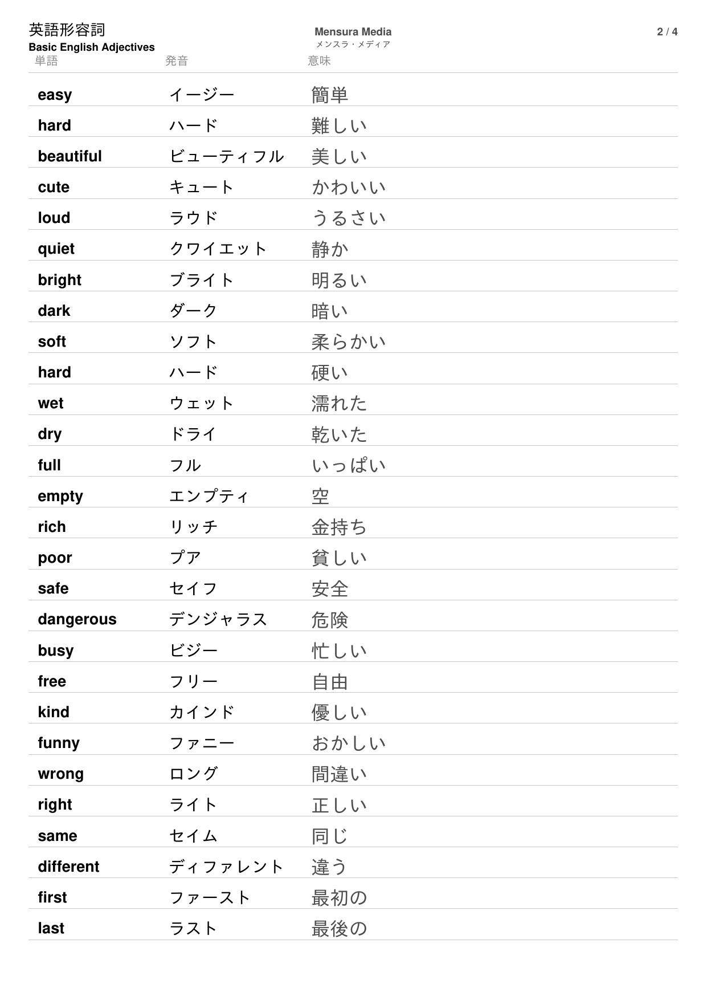 |

**内容：**
- **リファレンスチャート** &mdash; [`reference_chart_adjectives.pdf`](en_vocabulary/reference_chart_adjectives.pdf) &mdash; 基本形容詞、反対語ペア、テーマ別グループ（4ページ）
- **壁掛けポスター** &mdash; [`wall_prints_adjectives.pdf`](en_vocabulary/wall_prints_adjectives.pdf) &mdash; 大判の壁掛け用（11ページ）

### 名詞 &mdash; Nouns

体の部分、家族、日常の物など基本的な名詞。

<p align="center">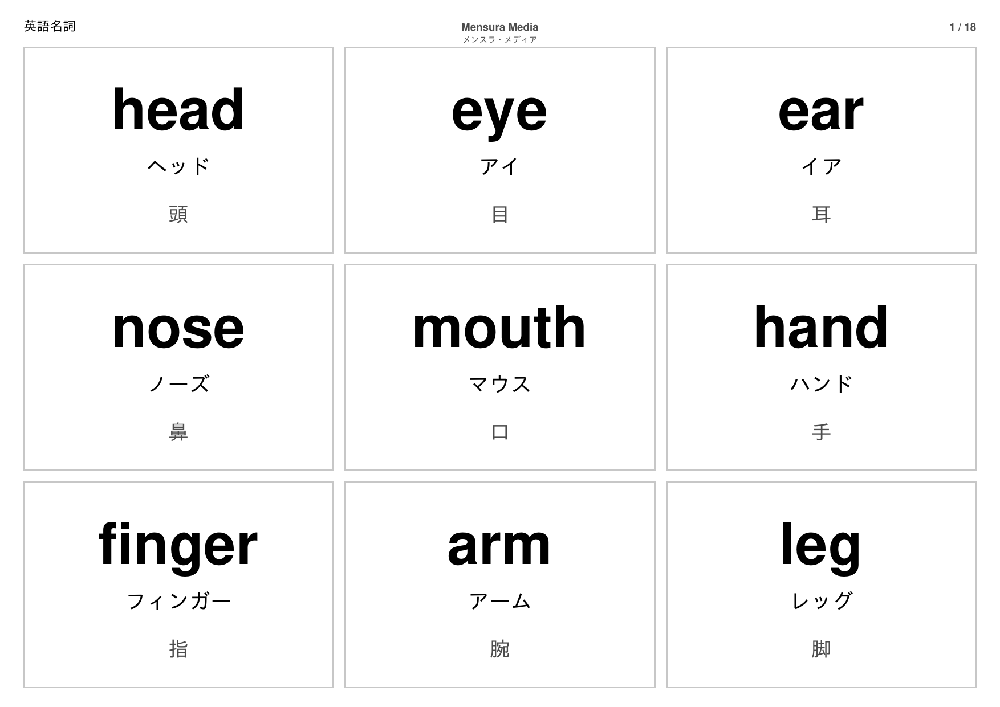</p>

**内容：**
- **壁掛けポスター** &mdash; [`wall_prints_nouns.pdf`](en_vocabulary/wall_prints_nouns.pdf) &mdash; 基本名詞の大判壁掛けカード（18ページ）

### 動詞 &mdash; Verbs

食べる、飲む、走る、書くなど日常動作の動詞。

<p align="center">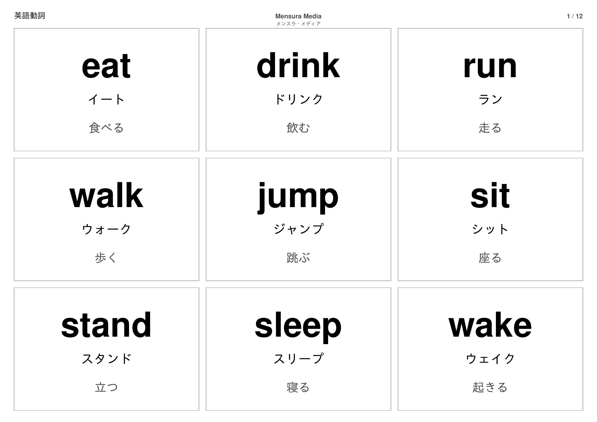</p>

**内容：**
- **壁掛けポスター** &mdash; [`wall_prints_verbs.pdf`](en_vocabulary/wall_prints_verbs.pdf) &mdash; 基本動詞の大判壁掛けカード（12ページ）

---

## 英検5級 &mdash; EIKEN Grade 5

英検5級の試験対策用単語集。あいさつ、代名詞、前置詞、時間表現、学校用語、日常生活の単語をカバー。

| リファレンスチャート | フラッシュカード | 壁掛けポスター |
|:---:|:---:|:---:|
| 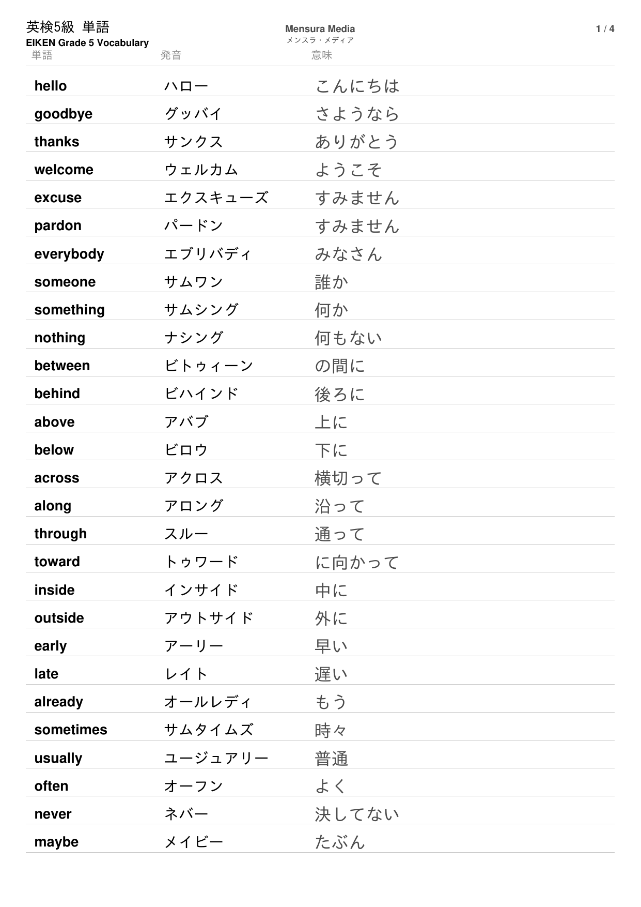 | 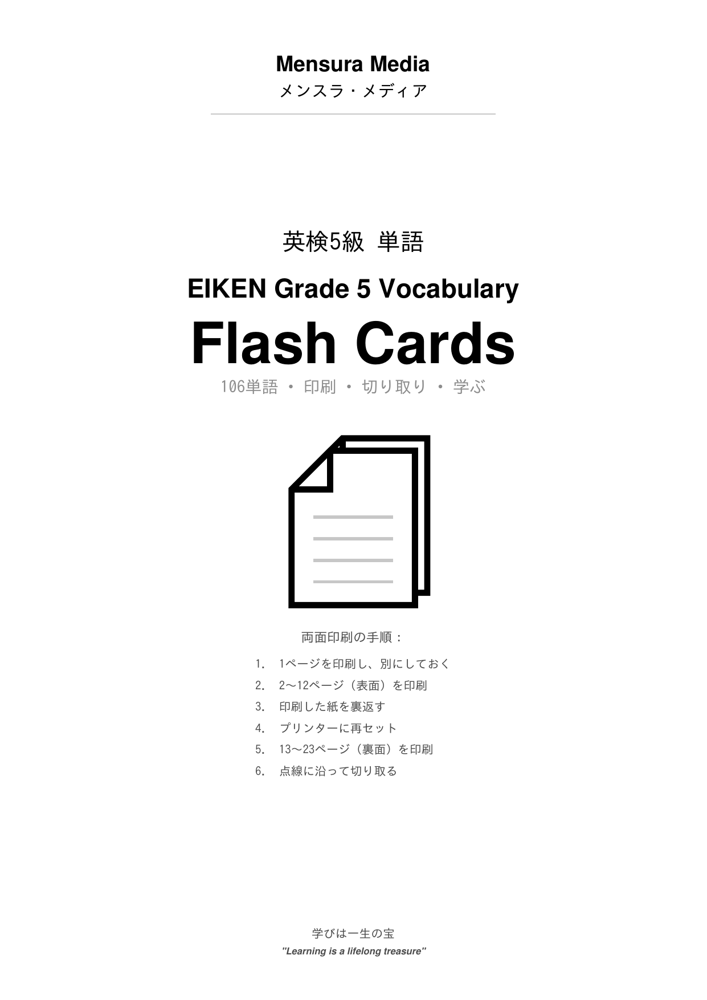 | 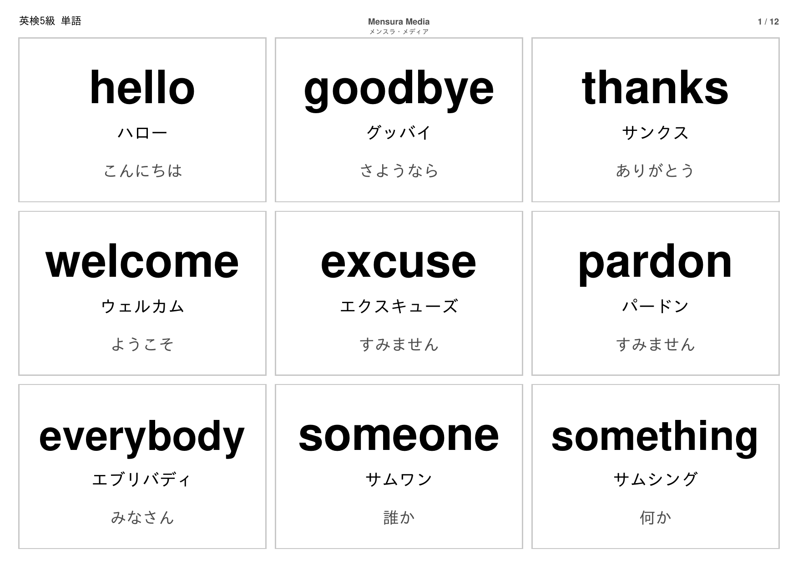 |

**内容：**
- **リファレンスチャート** &mdash; [`reference_chart_eiken5.pdf`](en_vocabulary/reference_chart_eiken5.pdf) &mdash; 106単語、カテゴリ別整理（4ページ）
- **フラッシュカード** &mdash; [`flashcard_eiken5.pdf`](en_vocabulary/flashcard_eiken5.pdf) &mdash; 106単語の両面印刷カード（23ページ）
- **壁掛けポスター** &mdash; [`wall_prints_eiken5.pdf`](en_vocabulary/wall_prints_eiken5.pdf) &mdash; 大判の壁掛け用（12ページ）

> 英検5級の合格を目指す方に。

---

## 文法・表現 &mdash; Grammar & Expressions

基本的な文法ルール、数字、時間表現、日常会話フレーズ。

### 文法基礎 &mdash; Basic Grammar

前置詞、疑問詞、代名詞の基本ルール。例文付き。

| サンプルページ |
|:---:|
| 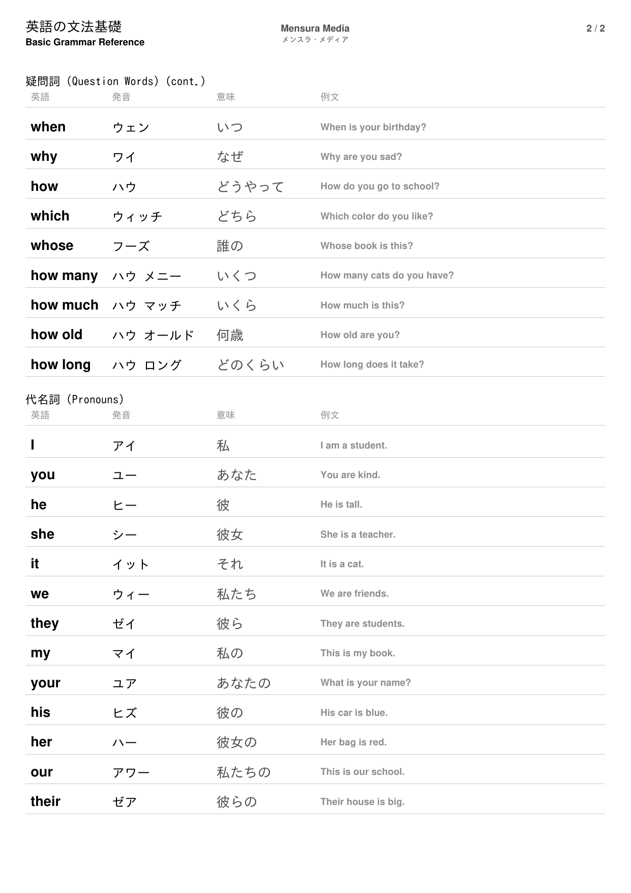 |

**内容：**
- **リファレンスチャート** &mdash; [`reference_chart_grammar.pdf`](en_grammar/reference_chart_grammar.pdf) &mdash; 前置詞20語、疑問詞12語、代名詞（主格・所有格）、例文付き（2ページ）

### 基本表現 &mdash; Common Expressions

あいさつ、丁寧な表現、自己紹介、質問、日常会話フレーズ。

<p align="center">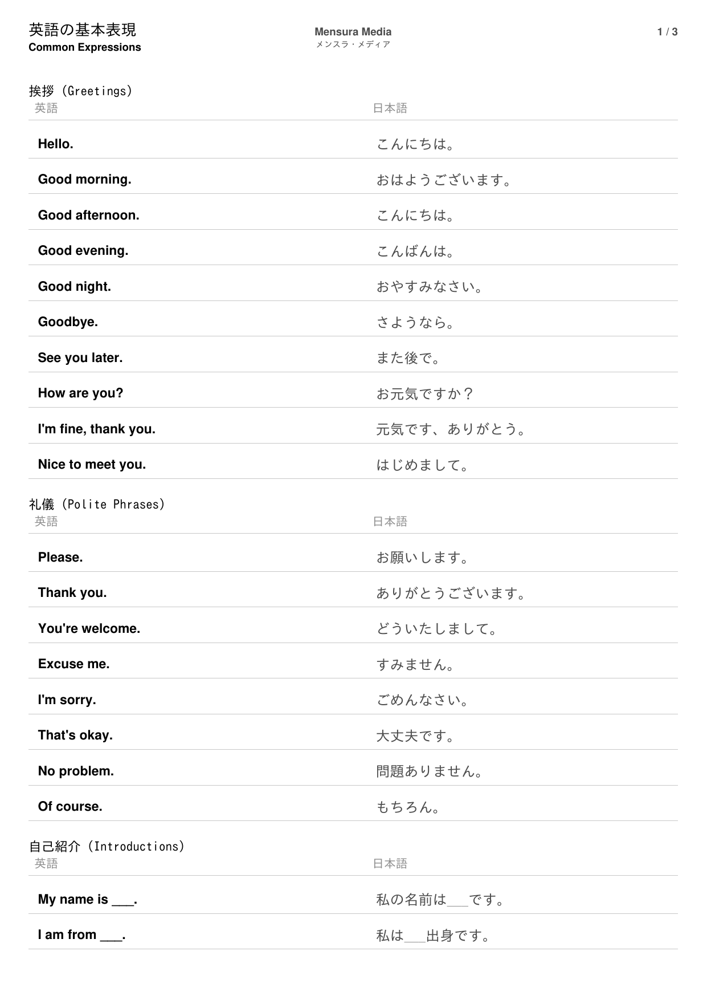</p>

**内容：**
- **リファレンスチャート** &mdash; [`reference_chart_expressions.pdf`](en_grammar/reference_chart_expressions.pdf) &mdash; カテゴリ別の日常会話フレーズ集（3ページ）

### 数字 &mdash; Numbers

基数（1〜1,000,000）と序数（1st〜100th）。カタカナ読み付き。

<p align="center">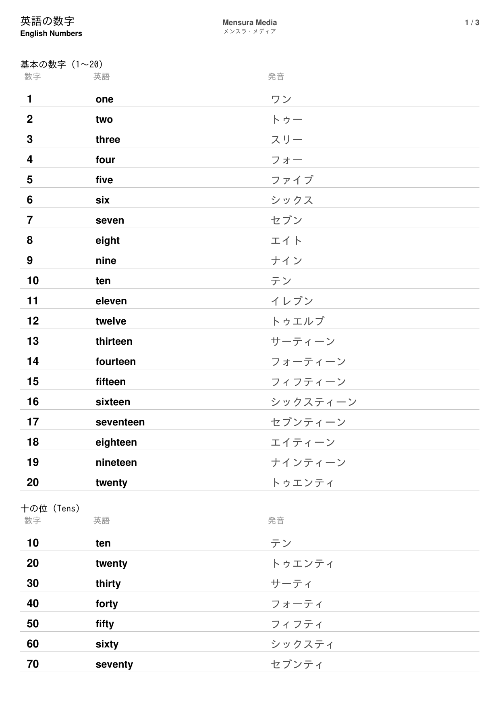</p>

**内容：**
- **リファレンスチャート** &mdash; [`reference_chart_numbers.pdf`](en_grammar/reference_chart_numbers.pdf) &mdash; 基数、十の位、大きな数、序数（3ページ）

### 時間・暦 &mdash; Time & Calendar

曜日、月、季節、時刻の表現、時間に関する単語。

<p align="center">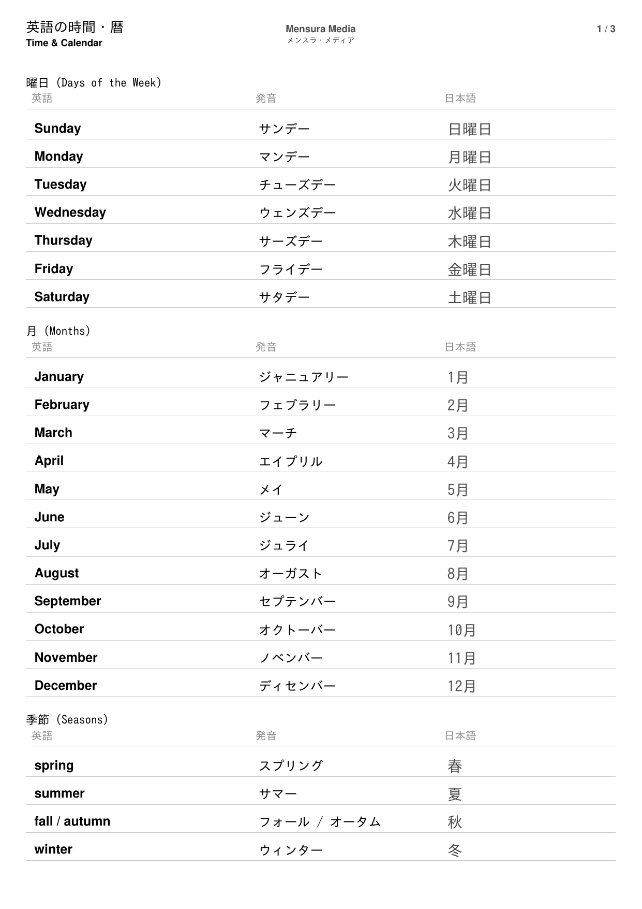</p>

**内容：**
- **リファレンスチャート** &mdash; [`reference_chart_time.pdf`](en_grammar/reference_chart_time.pdf) &mdash; 曜日、月、季節、時刻表現、時間の単語（3ページ）

---

## レッスン &mdash; Lessons

授業で使える日英バイリンガルフレーズ集。

| サンプルページ |
|:---:|
| 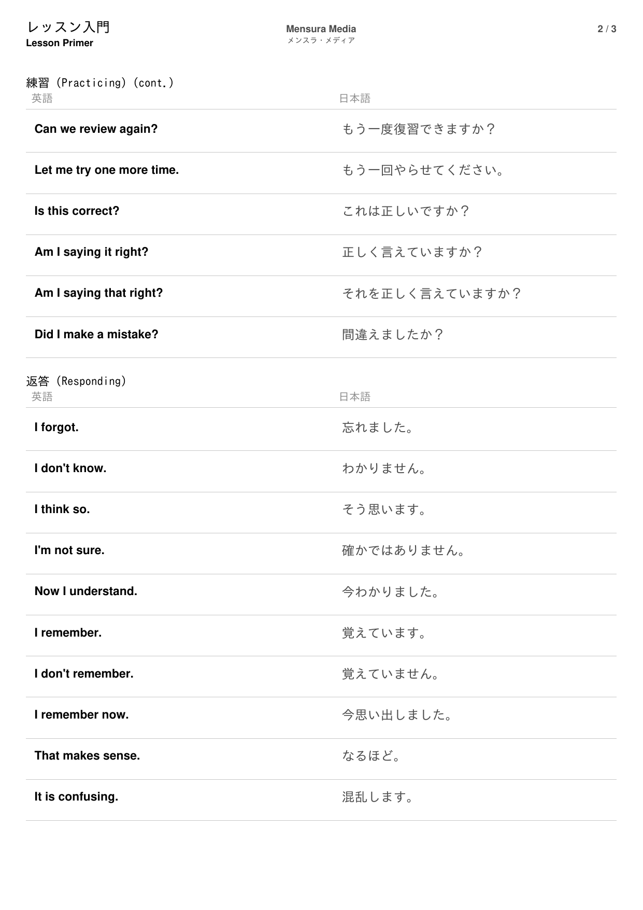 |

**内容：**
- **レッスン入門** &mdash; [`lesson_primer.pdf`](en_lessons/lesson_primer.pdf) &mdash; 授業中に使えるフレーズ：質問の仕方、練習、応答（3ページ）

> 英語の授業を始める前にぜひご活用ください。

---

## フォルダ構成

```
english/
├── README.md
├── images/                         # カバー画像・サンプル画像
├── en_alphabet/                    # アルファベット教材
│   ├── reference_chart_alphabet.pdf
│   └── wall_prints_alphabet.pdf
├── en_phonics/                     # フォニックス教材
│   ├── reference_chart_phonics.pdf
│   ├── flashcard_phonics.pdf
│   └── wall_prints_phonics.pdf
├── en_sightwords/                  # サイトワード教材
│   ├── reference_chart_sightwords.pdf
│   ├── flashcard_sightwords_200.pdf
│   ├── flashcard_sightwords_all.pdf
│   └── wall_prints_sightwords.pdf
├── en_vocabulary/                  # 語彙教材（名詞・動詞・形容詞・英検）
│   ├── reference_chart_adjectives.pdf
│   ├── reference_chart_eiken5.pdf
│   ├── flashcard_eiken5.pdf
│   ├── wall_prints_nouns.pdf
│   ├── wall_prints_verbs.pdf
│   ├── wall_prints_adjectives.pdf
│   └── wall_prints_eiken5.pdf
├── en_grammar/                     # 文法・表現・数字・時間
│   ├── reference_chart_grammar.pdf
│   ├── reference_chart_expressions.pdf
│   ├── reference_chart_numbers.pdf
│   └── reference_chart_time.pdf
└── en_lessons/                     # レッスン教材
    └── lesson_primer.pdf
```

## ライセンス

無料で使用・配布できます。制作：**Mensura Media**（メンスラ・メディア）
