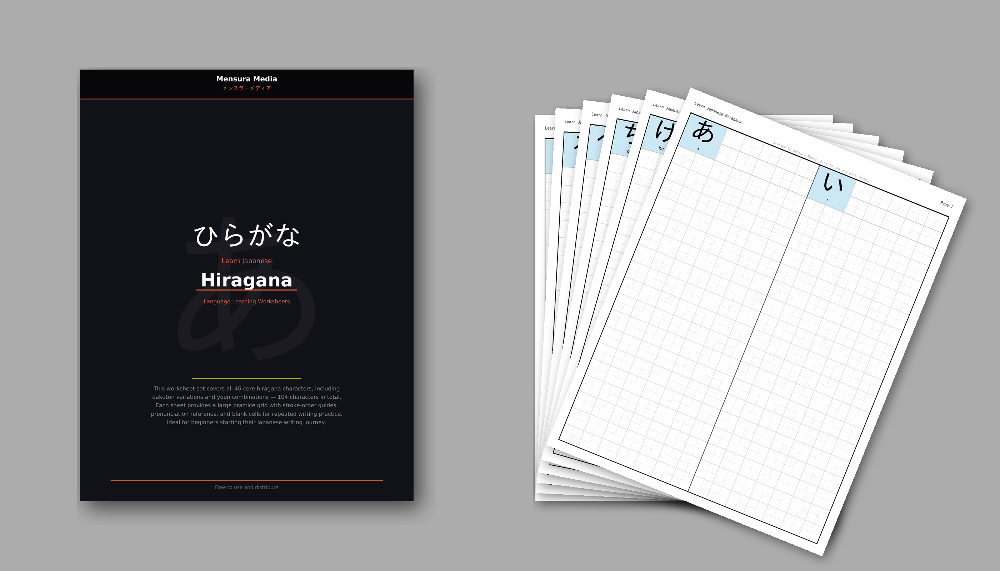

# Hiragana &mdash; ひらがな

The foundational Japanese phonetic script used for native Japanese words and grammatical elements. This set covers all 46 core hiragana characters plus dakuten variations and yoon combinations &mdash; **104 characters in total**.

## Worksheets

| File | Description |
|------|-------------|
| [`01-write-hiragana.pdf`](01-write-hiragana.pdf) | **Writing Practice Workbook** &mdash; Simple grid-based practice with 2 characters per page. Each character has a large blue-highlighted reference with romaji and rows of practice cells. |
| [`japanese-worksheet-hiragana-mensura-media-pdfa.pdf`](japanese-worksheet-hiragana-mensura-media-pdfa.pdf) | **Full Worksheet Set** &mdash; Includes a cover page, full table of contents listing all 104 characters (Basic, Dakuten, Yoon), and 52 pages of writing practice. |

## Characters Covered

- **Basic** (46): あ a, い i, う u, え e, お o, か ka ... through ん n
- **Dakuten** (25): が ga, ぎ gi ... through ぽ po
- **Yoon** (33): きゃ kya, きゅ kyu ... through ぴょ pyo

---

*Created by Mensura Media. Free to use and distribute.*
