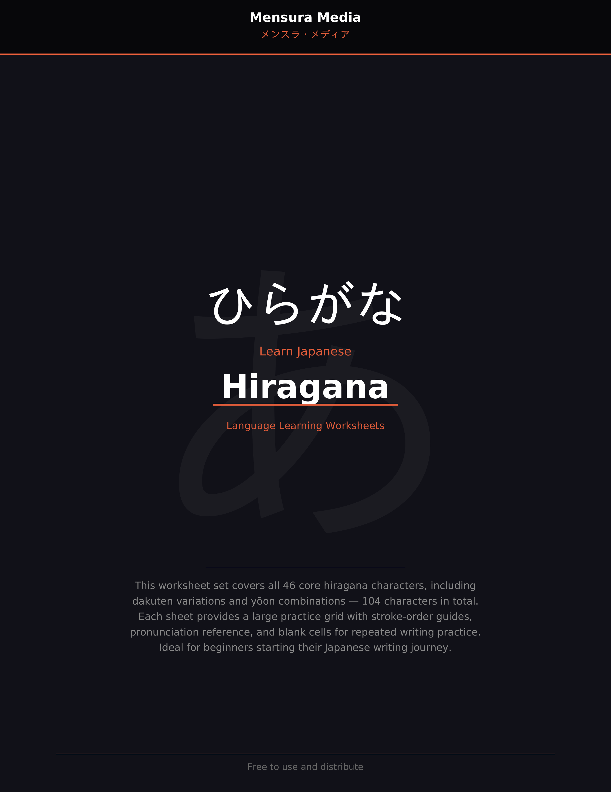
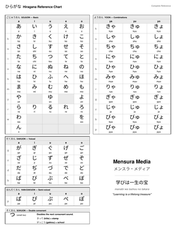

# Hiragana &mdash; ひらがな

The foundational Japanese phonetic script used for native Japanese words and grammatical elements. This set covers all 46 core hiragana characters plus dakuten variations and yoon combinations &mdash; **104 characters in total**.

## Worksheets

| File | Description |
|------|-------------|
| [`01-write-hiragana.pdf`](01-write-hiragana.pdf) | **Writing Practice Workbook** &mdash; Simple grid-based practice with 2 characters per page. Each character has a large blue-highlighted reference with romaji and rows of practice cells. |
| [`japanese-worksheet-hiragana-mensura-media-pdfa.pdf`](japanese-worksheet-hiragana-mensura-media-pdfa.pdf) | **Full Worksheet Set** &mdash; Includes a cover page, full table of contents listing all 104 characters (Basic, Dakuten, Yoon), and 52 pages of writing practice. |

## Reference Charts

| File | Description |
|------|-------------|
| [`simple_chart_hiragana.pdf`](simple_chart_hiragana.pdf) | **Simple Reference Chart** &mdash; Single-page black and white hiragana reference. Covers Gojuon, Dakuon, Han-dakuon, Sokuon, and Yoon combinations with romaji. Clean, printable, no colour fills. |

## Sentence Structure Practice

| File | Description |
|------|-------------|
| [`sentence_structure_themed_tables.html`](sentence_structure_themed_tables.html) | **Themed Sentence Tables (HTML)** &mdash; 16 themed Japanese sentence structure exercise tables for beginners. Dark background, no borders. Shows English sentences in Japanese word order (Topic &rarr; Object &rarr; Verb) alongside romaji. Open in any browser — no dependencies. |
| [`sentence_structure_writing_practice.pdf`](sentence_structure_writing_practice.pdf) | **Writing Practice with Sentence Tables (PDF)** &mdash; Landscape A4 workbook. 16 themed sentence tables with hiragana and katakana reference strips and blank writing lines below each sentence for handwriting practice. |

## Characters Covered

- **Basic** (46): あ a, い i, う u, え e, お o, か ka ... through ん n
- **Dakuten** (25): が ga, ぎ gi ... through ぽ po
- **Yoon** (33): きゃ kya, きゅ kyu ... through ぴょ pyo

| Simple Reference Chart | Sentence Structure Tables | Writing Practice |
|:---:|:---:|:---:|
|  |  |  |

---

*Created by Mensura Media. Free to use and distribute.*
