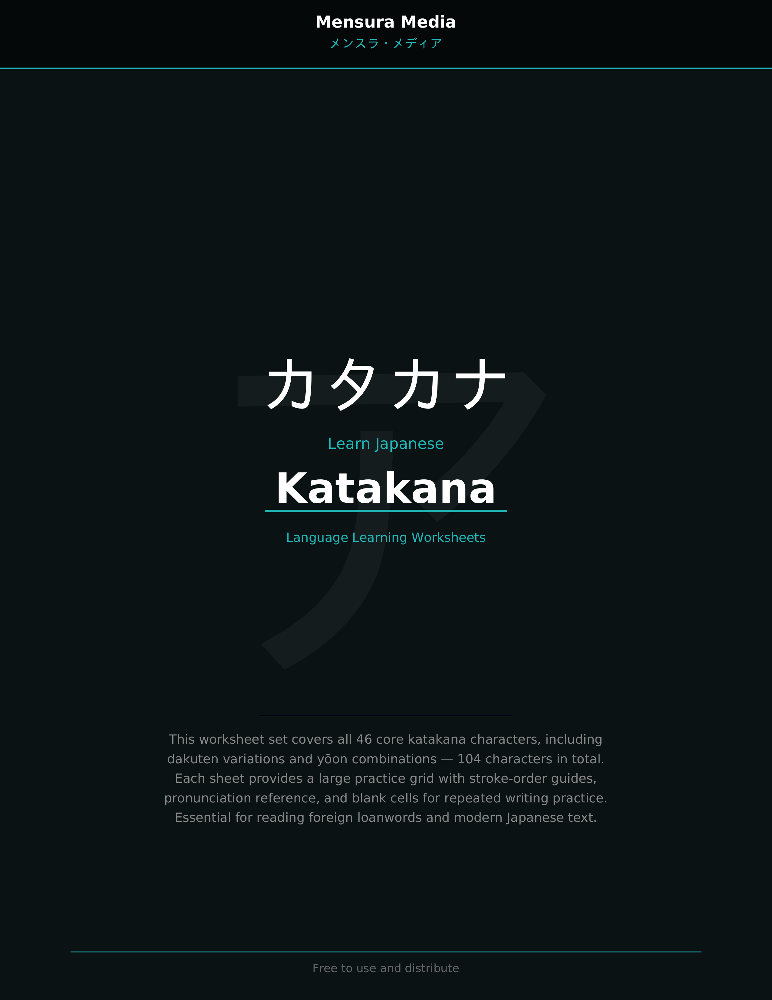
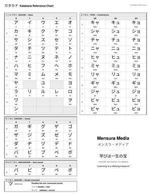
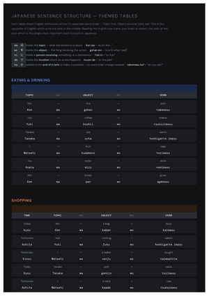
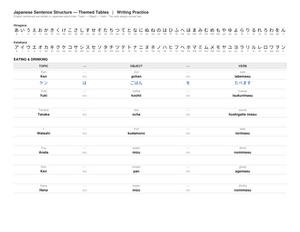

# Katakana &mdash; カタカナ

The Japanese phonetic script used for foreign loanwords, technical terms, and emphasis. This set covers all 46 core katakana characters plus dakuten variations and yoon combinations &mdash; **104 characters in total**.

## Worksheets

| File | Description |
|------|-------------|
| [`02-write-katakana.pdf`](02-write-katakana.pdf) | **Writing Practice Workbook** &mdash; Simple grid-based practice with 2 characters per page. Each character has a large tan-highlighted reference with romaji and rows of practice cells. |
| [`japanese-worksheet-katakana-mensura-media-pdfa.pdf`](japanese-worksheet-katakana-mensura-media-pdfa.pdf) | **Full Worksheet Set** &mdash; Includes a cover page, full table of contents listing all 104 characters (Basic, Dakuten, Yoon), and 52 pages of writing practice. |

## Reference Charts

| File | Description |
|------|-------------|
| [`simple_chart_katakana.pdf`](simple_chart_katakana.pdf) | **Simple Reference Chart** &mdash; Single-page black and white katakana reference. Covers Gojuon, Dakuon, Han-dakuon, Sokuon, and Yoon combinations with romaji. Clean, printable, no colour fills. |

## Sentence Structure Practice

| File | Description |
|------|-------------|
| [`sentence_structure_themed_tables.html`](sentence_structure_themed_tables.html) | **Themed Sentence Tables (HTML)** &mdash; 16 themed Japanese sentence structure exercise tables for beginners. Dark background, no borders. Shows English sentences in Japanese word order (Topic &rarr; Object &rarr; Verb) alongside romaji. Open in any browser — no dependencies. |
| [`sentence_structure_writing_practice.pdf`](sentence_structure_writing_practice.pdf) | **Writing Practice with Sentence Tables (PDF)** &mdash; Landscape A4 workbook. 16 themed sentence tables with hiragana and katakana reference strips and blank writing lines below each sentence for handwriting practice. |

## Characters Covered

- **Basic** (46): ア a, イ i, ウ u, エ e, オ o, カ ka ... through ン n
- **Dakuten** (25): ガ ga, ギ gi ... through ポ po
- **Yoon** (33): キャ kya, キュ kyu ... through ピョ pyo

| Simple Reference Chart | Sentence Structure Tables | Writing Practice |
|:---:|:---:|:---:|
|  |  |  |

---

*Created by Mensura Media. Free to use and distribute.*
